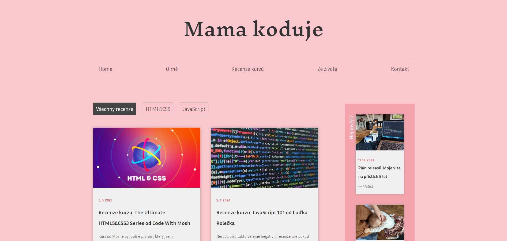

# Máma kóduje - Coding Blog

A blog dedicated to moms and women in tech. Máma kóduje provides reviews, tips, and posts for those looking to get started with coding and strugling with their daily mother responsibilities.

**The main goal of this project is to create a welcoming space for moms and beginners in tech to grow as developers.**

## Main Topics

- Access a variety of coding reviews
- Find resources specifically tailored to beginners, moms, and women in tech
- Learn how to balance coding with family life through practical tips and advice
- Stay motivated and connected through a supportive community of like-minded individuals

